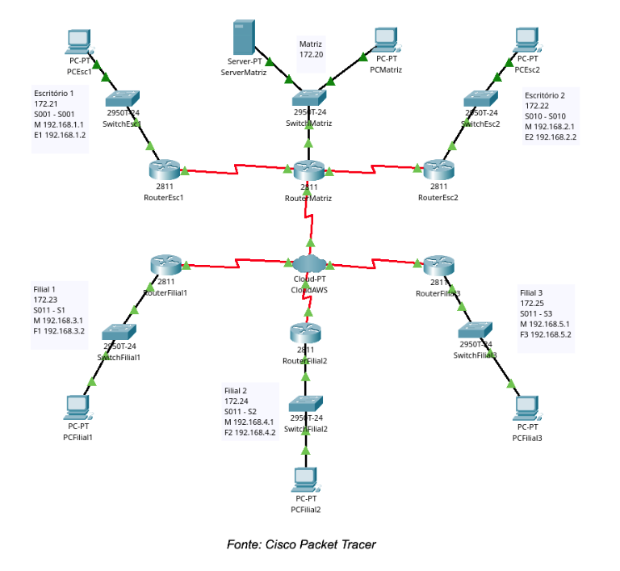
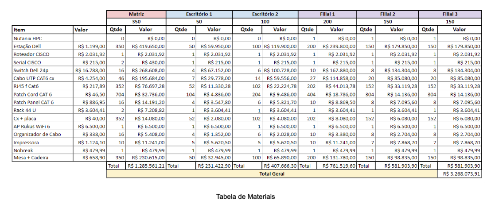
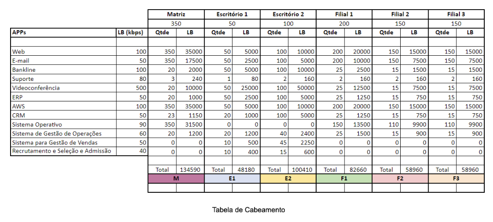

# Análise, Planejamento e Prototipação da Solução

# 1. Tema

O grupo optou pela escolha de uma empresa de manufatura com um quadro de funcionários de aproximadamente 1000 colaboradores e especializada em bens de consumo de linha branca como batedeiras, liquidificadores, cafeteiras e assadeiras.

De acordo com as classificações do IBGE, uma empresa com esse tamanho é considerada de grande porte, o que implica em responsabilidades e desafios distintos em comparação com empresas de menor porte para a distribuição e definição de sua estrutura de rede.

A estrutura de uma empresa de manufatura de grande porte é altamente complexa e precisa estar organizada. Para operar de maneira eficiente, ela geralmente é composta por diferentes departamentos e setores interconectados. A seguir, temos alguns dos principais aspectos dessa estrutura:

1. **Departamento de Produção**: A produção de eletrodomésticos de linha branca envolve várias etapas, desde o design e desenvolvimento de produtos até a fabricação em si.
2. **Pesquisa e Desenvolvimento**: Para se manter competitiva no mercado, a empresa investe em pesquisa e desenvolvimento para criar produtos inovadores e eficientes em termos energéticos.
3. **Logística e Cadeia de Suprimentos**: O gerenciamento eficaz da cadeia de suprimentos é essencial para garantir que os componentes e materiais necessários estejam disponíveis quando necessário e que os produtos acabados sejam entregues aos clientes.
4. **Controle de Qualidade**: Dada a natureza crítica dos produtos eletrodomésticos em termos de segurança e desempenho, a empresa necessita ter um rigoroso controle de qualidade em cada etapa de fabricação. 
5. **Recursos Humanos**: Com 1000 funcionários, a gestão de recursos humanos é um departamento vital, encarregado de contratação, treinamento, avaliação de desempenho e desenvolvimento profissional dos colaboradores.
6. **Vendas e Marketing**: Para atingir um público amplo e diversificado, a empresa precisa investir em estratégias de vendas e marketing para promover seus produtos e expandir sua base de clientes.
7. **Finanças e Administração**: O departamento financeiro cuida das finanças da empresa, incluindo orçamento, contabilidade e relatórios financeiros.

Uma empresa de manufatura de grande porte como a nossa é caracterizada por uma abordagem orientada para a automação de seus processos e a tecnologia aplicada em pesquisa, visando aumentar a eficiência e a produtividade a cada ano.
A seguir, destacam-se várias razões pelas quais uma infraestrutura de rede eficiente é crucial para o sucesso desse tipo de empresa:

- Comunicação Interna e Cooperação;
- Segurança de Dados;
- Expansão e Escalabilidade;
- Acesso Remoto;
- Competitividade;
- Automação e Controle de Processos;
- Gestão de Cadeia de Suprimentos;
- Gestão de Manutenção.

Definitivamente uma estrutura de rede bem-sucedida é um componente crítico para garantir a eficiência operacional, a qualidade do produto e a competitividade de uma empresa de grande porte de manufatura, como a especializada em eletrodomésticos de linha branca. Ela permite uma integração eficaz de todos os aspectos da operação, desde o chão de fábrica até a gestão de recursos, promovendo a excelência nos negócios.

# 2. Planejamento dos recursos de rede

Cenário: a rede será composta da matriz da empresa em Betim (MG) que se liga com seus 2 escritórios em Belo Horizonte (MG). Além disso, a empresa também contará com 3 filiais, localizadas em São Paulo (SP), Curitiba (PR) e Rio de Janeiro (RJ). Segue algumas características de cada local da rede:

### Matriz (Betim, MG)
- Departamento de Produção
- Departamento de Logística e Distribuição
- Departamento de Qualidade e Segurança
- Produção

### Escritório 1: Planejamento e estratégia (Belo Horizonte, MG)
- Diretoria Executiva
- Departamento de Pesquisa e Desenvolvimento (P&D)
- Departamento de TI

### Escritório 2: Escritório de Desenvolvimento de Mercado (Belo Horizonte, MG)
- Departamento de Marketing e Vendas
- Departamento de Recursos Humanos
- Departamento Financeiro e Contábil

### Filiais (Cada uma das filiais possuíra os departamentos abaixo)
- Departamento de Operações Regionais
- Departamento de Vendas Regionais
- Departamento de Logística Regional
- Departamento de Gerenciamento de Filiais
- Departamento de Suporte Técnico Regional

## 2.1 Divisão física da rede

Com base em todo esse cenário, a divisão física da rede ficou representada conforme a imagem abaixo. A topologia escolhida foi a hierárquica.

## 2.2 Planilha de materiais

A tabela a seguir reflete a lista de materiais que serão empregados no projeto bem como seus valores correspondentes. A final é demonstrado o valor orçado que será necessário para a Matriz (R$ 1.285.56,21), Escritório 1 (R$ 231.422,90), Escritório 2 (R$ 407.666,30), Filial 1 (R$ 761.51,60), Filial 2 (R$ 581.903,90) e Filial 3 (R$ 581.903,90). O total geral estimado para este projeto é de R$3.268.073,91.

## 2.3 Divisão lógica da rede

A tabela abaixo contém os dispositivos da rede, seus nomes, endereçamento, portas e roteamento.

Dispositivos | Nome | Portas / Endereçamento
--------|-----------|-------------------------
Nuvem | CloudAWS | |
Roteador | RouterMatriz | |
Roteador | RouterEsc1 | |
Roteador | RouterEsc2 | |
Roteador | RouterFilial1 | |
Roteador | RouterFilial2 | |
Roteador | RouterFilial3 | |
Switch | SwitchMatriz | |
Switch | SwitchEsc1 | |
Switch | SwitchEsc2 | |
Switch | SwitchFilial1 | |
Switch | SwitchFilial2 | |
Switch | SwitchFilial3 | |
Servidor | ServerMatriz | |
Computador | PC1Matriz | |
Computador | PC2Matriz | IPv4 Address: 172.20.2.12/16 (Notação CIDR) |
Computador | PC1Esc1 | |
Computador | PC2Esc1 | IPv4 Address: 172.21.0.12/16 (Notação CIDR) |
Computador | PC1Esc2 | |
Computador | PC2Esc2 | IPv4 Address: 172.22.0.12/16 (Notação CIDR) |
Computador | PC1Filial1 | |
Computador | PC2Filial1 | IPv4 Address: 172.23.0.12/16 (Notação CIDR) |
Computador | PC1Filial2 | |
Computador | PC2Filial2 | IPv4 Address: 172.24.0.12/16 (Notação CIDR) |
Computador | PC1Filial3 | |
Computador | PC2Filial3 | IPv4 Address: 172.25.0.12/16 (Notação CIDR) |

## 2.4 Planilha links

A tabela abaixo contém informações correspondentes a divisão de colaboradores por cada localidade dentro da estrutura da empresa e da utilização da estrutura de rede quanto a aplicações e serviços. A matriz conta com um número abrangente de 350 colaboradores por ser a sede de produção, o escritório 1 conta com 50 colaboradores que atuam como diretoria e estratégia de negócio, escritório 2 conta com 100 colaboradores atuando em vendas e RH e as filias compartilham estruturas locais centralizadas variando entre 150 e 200 colaboradores.

