# Preparação de ambiente em Nuvem e Virtualização Local

# 3. Implementação dos recursos da rede

## 3.1 Implementação do servidor físico da matriz

Foi implementado servidor local através do Oracle VM VirtualBox contendo os seguintes recursos:

- Sistema Operacional: Windows Server 2012 R2 64 bits
- CPU: Intel Core I5 - 10500 h 2.50GHz 5.50GHz
- Memória RAM: 2GB
- Nome do servidor: ServerMatrizLoc01
- Domínio: manufatura.net

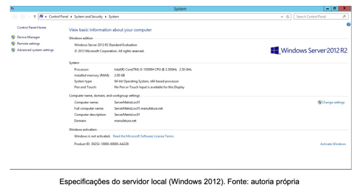

### 3.1.1 Instalação e configuração do DHCP

Foi instalado e configurado o protocolo DHCP para distribuição de IP’s dentro da faixa abaixo:

- **Faixa inicial**: 172.20.0.11
- **Faixa final**: 172.20.1.254

Desta forma poderá atender aos 350 computadores da Matriz e caso seja necessário acrescentar computadores a rede local, já será possível disponibilizar IP’s para estes novos computadores.

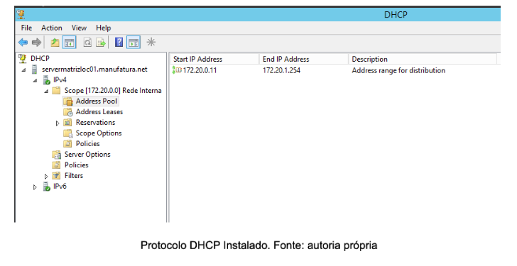

### 3.1.2 Instalação e configuração do DHCP

Foi ativado o recurso do Active Directory e configurado para o domínio manufatura.net onde foram criadas as seguintes estruturas organizacionais:

- Belo Horizonte (MG), contemplando os dois escritórios localizados em Belo Horizonte;
- Betim (MG);
- Curitiba (PR);
- Rio de Janeiro (RJ);
- São Paulo (SP).

Também foram criados usuários dentro do domínio:

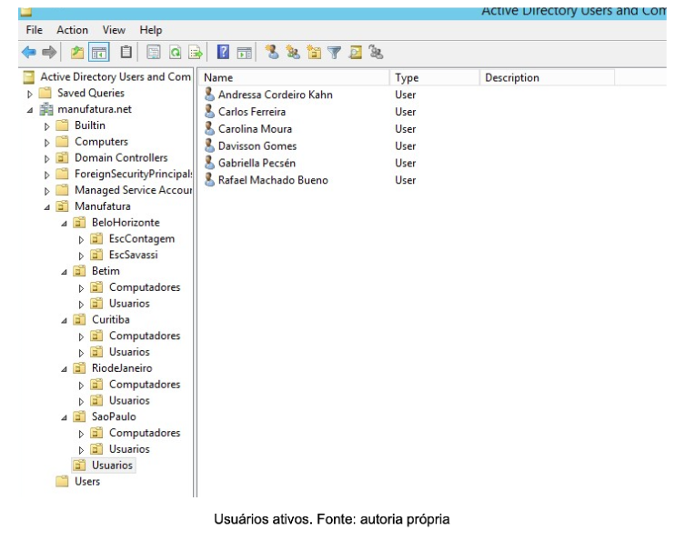

### 3.1.3 Políticas de grupo aplicadas

Foram aplicadas as políticas abaixo:
- Proibir acesso ao Painel de Controle e Configurações do PC;
- Ir para o Desktop ao invés do Iniciar ao realizar login;
- Remover ícone de música do menu Iniciar.

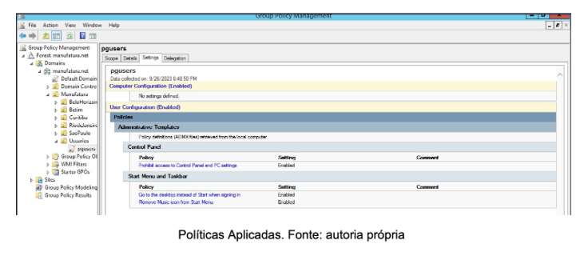

## 3.2 Implementação de um servidor na nuvem para a matriz

Com o objetivo de criarmos um servidor para a matriz na AWS, prestadora de serviços em nuvem, foi preciso executar os seguintes passos mostrados abaixo:

A 1ª etapa foi a criação de uma rede virtual (VPC) para a configuração dos recursos da rede. Para isso, criamos a manufatura-vpc com 2 subredes públicas e 2 subredes privadas em 2 zonas de disponibilidade distintas. A criação da VPC permitirá a alocação do servidor dentro da rede manufatura-vpc criada.

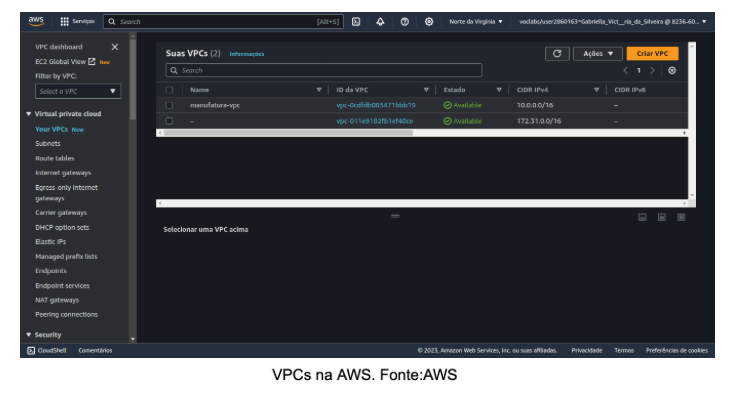

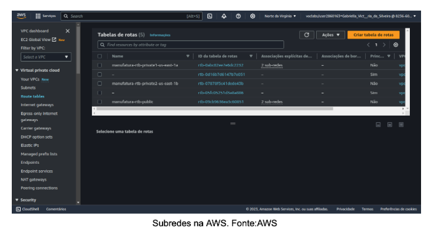

A 2ª etapa consistiu na criação de um grupo de segurança para atuar como um firewall de nossa rede. Criamos 2 regras de entrada: uma para permitir que qualquer endereço IPV4 pudesse acessar o servidor remotamente via RDP; outra para permitir que qualquer endereço IPV4 pudesse acessar o endereço IP de nosso servidor a partir de um navegador web com o protocolo HTTP. A imagem abaixo mostra o grupo de segurança criado e as 2 regras de entrada.

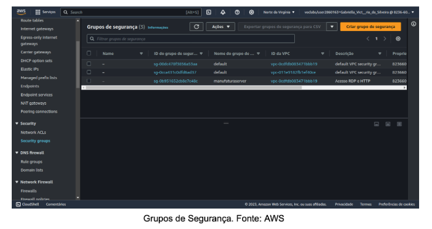

A 3ª etapa foi criar uma instância na AWS para o nosso servidor. Para isso, criamos uma instância EC2 com o sistema operacional do Windows Server 2016 Base e no tipo t2.large. Esse tipo de instância possui recursos de hardware suficientes para o nosso servidor. Colocamos a instância dentro da VPC e do grupo de segurança manufaturaserver.

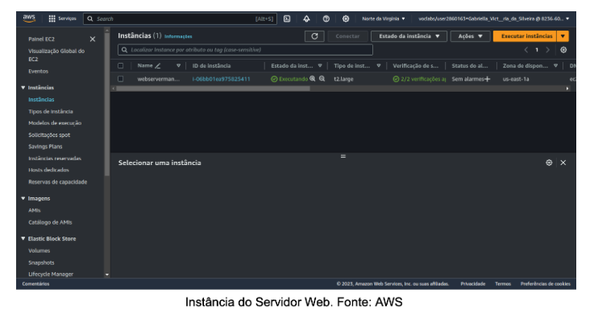

A 4ª etapa foi para acessarmos o servidor criado via RDP e instalar o serviço de servidor web da Microsoft, o IIS. Realizamos a instalação do serviço e seguimos com a tentativa de acesso à página web de nosso servidor. As imagens abaixo mostram todo esse processo. Algumas imagens mostram IPs públicos diferentes em relação ao servidor. Isso ocorreu, pois a AWS altera o IP público do servidor após algum tempo.

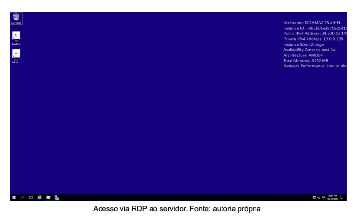

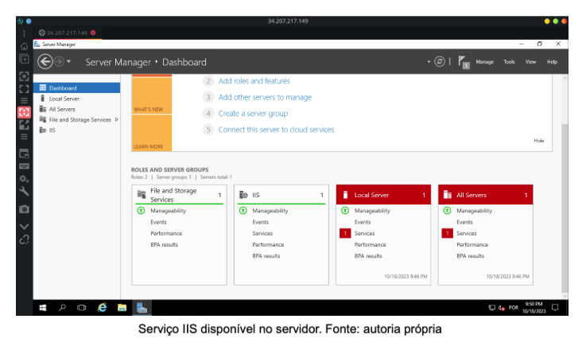

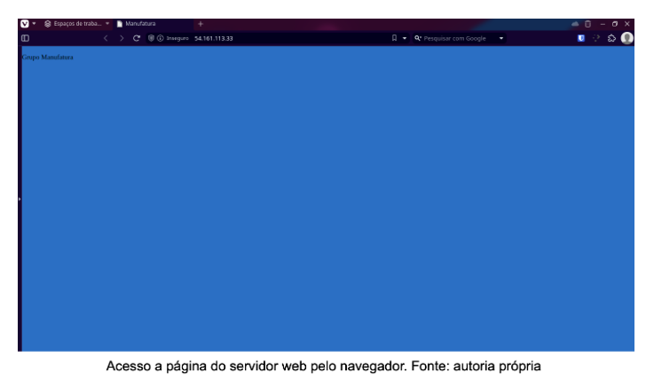

