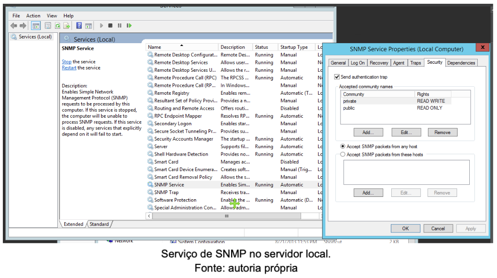
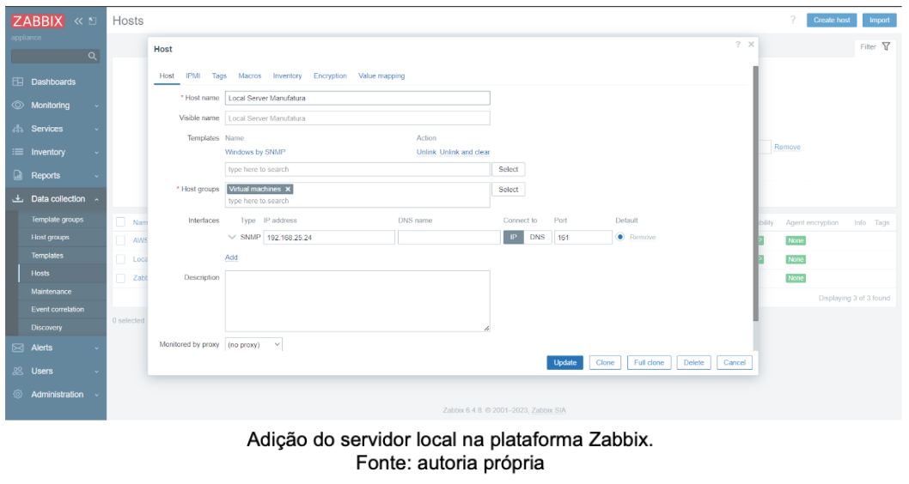
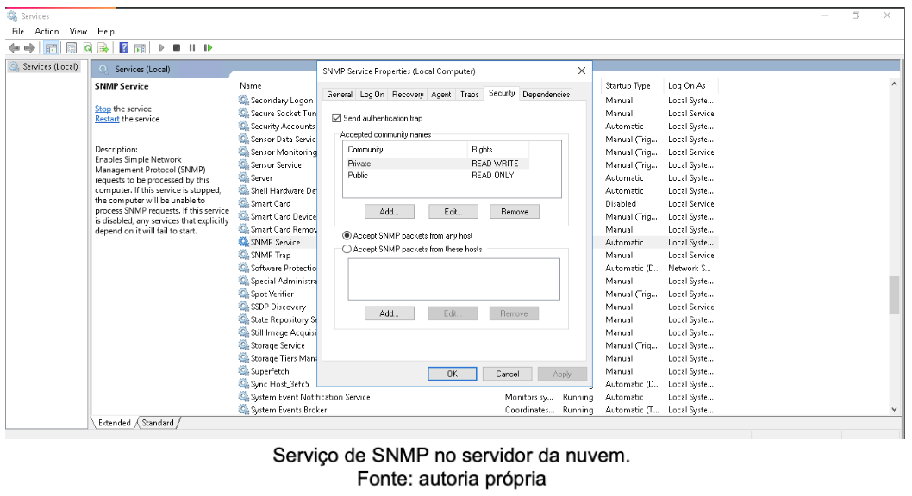
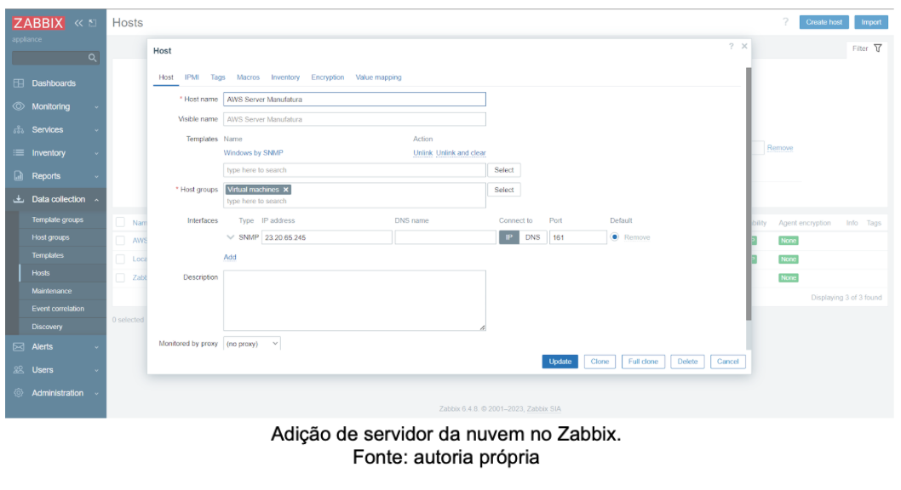
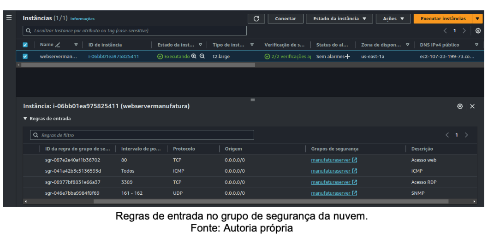
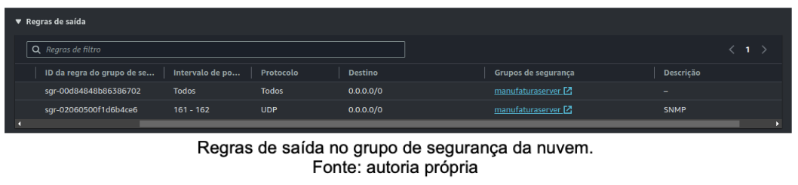
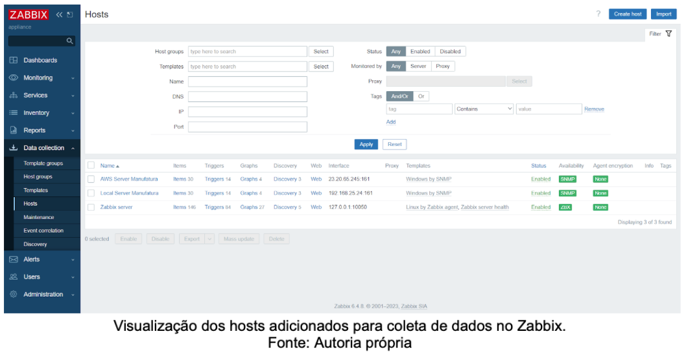
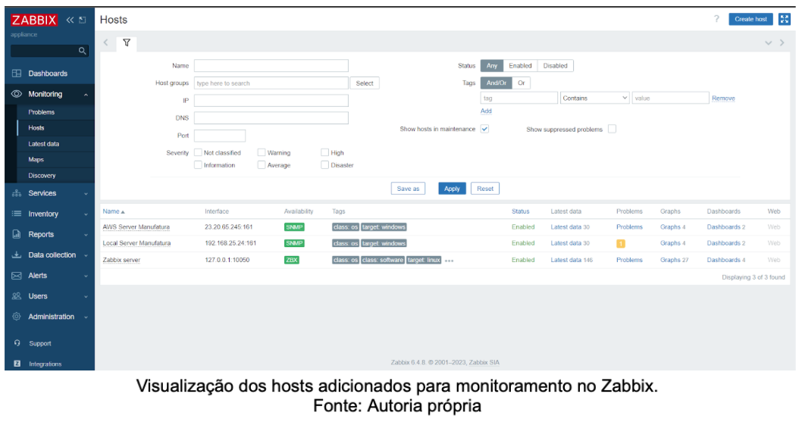
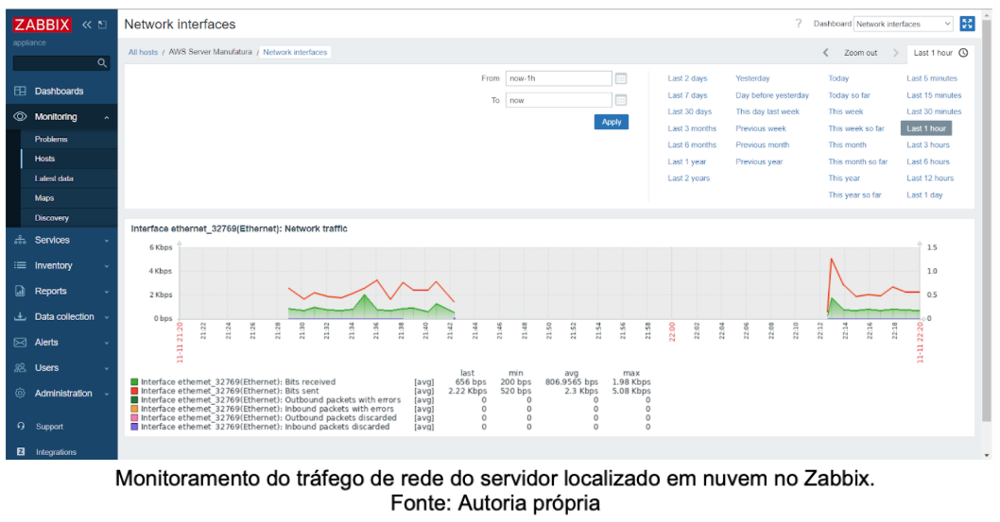
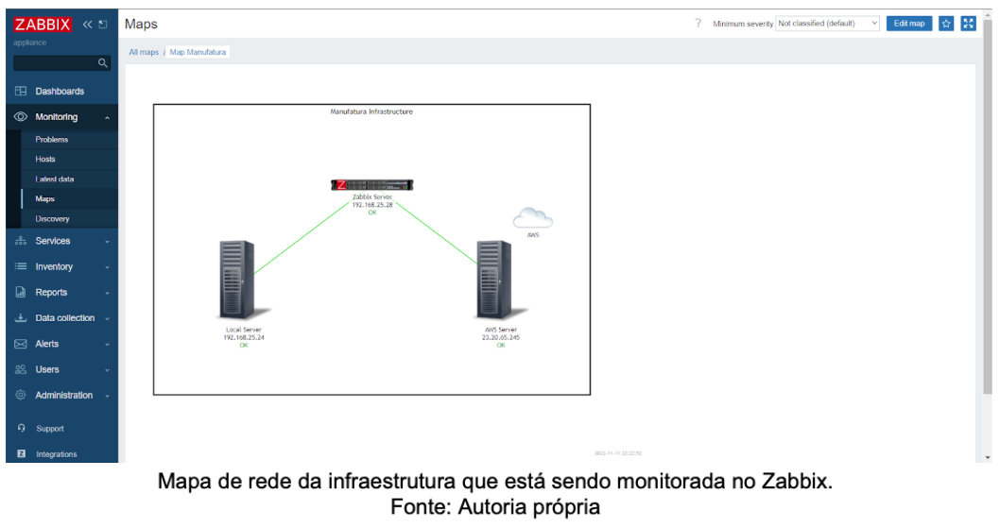

# Gerência e Monitoração de ambientes de redes

# 4. Gerenciamento dos servidores no Zabbix

## 4.1 Gerenciamento do servidor físico no Zabbix

Para sermos capazes de realizar o monitoramento do servidor físico na rede, foi necessário realizar a integração desse servidor no zabbix, uma ferramenta de monitoramento de infraestrutura de TI. Para isso, o protocolo SNMP foi utilizado, pois ele permite o gerenciamento de dispositivos em uma rede por meio do seu IP.

Conforme a imagem mostrada abaixo, o serviço do protocolo SNMP foi configurado no servidor local em relação às suas community com duas strings: private (para acesso de leitura e escrita) e public (para acesso somente de leitura). Essas strings funcionam como chaves de acesso para a integração do servidor com o software Zabbix.

Com a configuração das communities no servidor local, iniciamos o processo de configuração do host no zabbix. Para isso foi necessário o preenchimento de algumas informações na plataforma de monitoramento como o nome do host, o protocolo utilizado, seu IP, a porta, seu template e seu host group. Essas informações foram necessárias para o Zabbix ser capaz de encontrar e requisitar informações do host que desejávamos monitorar.

As regras de firewall no servidor local foram observadas para que o acesso do zabbix na porta 161 não fosse bloqueado. Entretanto, não encontramos qualquer impedimento nesse processo.

## 4.2 Gerenciamento do servidor da nuvem no Zabbix

A configuração do SNMP no servidor localizado em nuvem seguiu os mesmos passos do servidor local com a execução do serviço SNMP e a configuração das communities private e public.

A configuração do servidor localizado em nuvem no zabbix seguiu os mesmos critérios em relação ao preenchimento das suas informações na plataforma, conforme imagem abaixo.

A diferença consistiu na necessidade da liberação de portas no grupo de segurança criado na AWS, pois sem essa liberação não seria possível o Zabbix realizar a comunicação com o servidor na nuvem. As portas relacionadas aos protocolos SNMP e ICMP foram liberadas.

## 4.3 Visualização do monitoramento dos servidores no Zabbix

Com a configuração realizada no servidor local e no servidor da nuvem, o Zabbix já conseguia monitorar os servidores. Verificamos na ferramenta que ambas as comunicações com os hosts estavam sendo executadas sem qualquer falha, conforme imagens abaixo.

As telas abaixo mostram o resultado do monitoramento de ambos os hosts: servidor local e servidor da nuvem. Os gráficos mostram a quantidade de tráfego de rede advinda dos servidores na última hora.

A plataforma Zabbix também torna possível a visualização de um mapa de nossa infraestrutura de rede que está sendo monitorada. A imagem abaixo mostra o servidor do Zabbix e sua integração com o servidor local e o servidor da nuvem.

